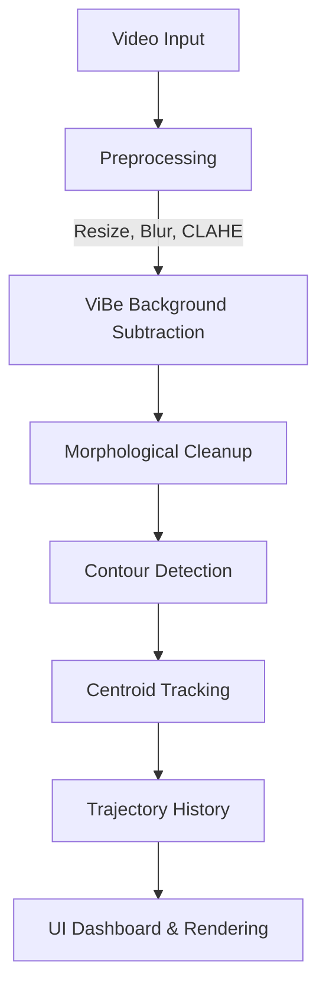

<div align="center">
  <h1>🎯 ViBe Surveillance System</h1>
  <p><b>Moving Object Detection & Trajectory Tracking</b></p>

  <p>
    
    
    
    
  </p>
</div>

---

A high-performance, real-time computer vision application designed to detect moving objects and track their trajectories using a custom implementation of the **ViBe (Visual Background Extractor)** algorithm. Wrapped in a stunning, modern **Soft Charcoal** PyQt5 UI.

## ✨ Key Features

### 🧠 Core Algorithm
- **Custom ViBe Implementation**: Built from scratch based on Barnich & Van Droogenbroeck (2011) for robust background subtraction and foreground segmentation.
- **Centroid-Based Tracking**: Multi-object trajectory tracker using greedy nearest-neighbor matching.
- **Morphological Pipeline**: Advanced noise reduction using Erosion, Dilation, and Closing operations.

### 🎨 Modern UI & UX
- **Soft Charcoal Theme**: A premium, minimalist Vercel/Tailwind-inspired dark theme (`#18181b` Zinc background) that reduces eye strain and highlights video content.
- **Tabbed Video Player**: Cleanly switch between `Live Detection`, `Original Feed`, `Foreground Mask`, and `Trajectories` without clutter.
- **Instant Preview**: Automatically extracts and displays the first frame of a video immediately upon upload.

### 📊 Real-Time Analytics Dashboard
- **Minimalist Metrics**: Live tracking of **FPS**, **Active Objects**, **Motion %**, and **Processing Time** without intrusive backgrounds.
- **Embedded Charts**: Real-time matplotlib integration displaying "FPS Over Time".
- **Dynamic Controls**: Adjust detection sensitivity (min area), trajectory length, and toggle preprocessing filters (Blur, Median, CLAHE) on the fly.

### 💾 Output & Export
- **Video Recording**: Save the processed detection feed directly to `.mp4`.
- **Snapshot Tool**: Capture high-resolution screenshots of the live feed.
- **Performance Reports**: Export visual graphs detailing system performance (FPS, objects, motion intensity).

---

## 🚀 Getting Started

### Prerequisites
Make sure you have Python 3.10+ installed on your system.

### Installation

1. **Clone the repository:**
   ```bash
   git clone https://github.com/yourusername/ViBe-Surveillance.git
   cd ViBe-Surveillance
   ```

2. **Install dependencies:**
   ```bash
   pip install -r requirements.txt
   ```

3. **Run the Application:**
   Change directory to `src` before running so that internal paths resolve correctly:
   ```bash
   cd src
   python main.py
   ```

---

## 🎮 Usage Guide

1. **Upload Video**: Click the crisp white `📂 Upload` button in the sidebar and select an `.mp4`, `.avi`, or `.mkv` file. The first frame will instantly preview.
2. **Start Detection**: Click `▶ Start`. The ViBe algorithm will automatically initialize its background model from the first frame.
3. **Monitor the Feed**: Switch tabs above the video player to inspect the Raw Feed, the computed Background Mask, or the final Tracking output.
4. **Tune Parameters**: 
   - If you see too much noise, increase the **Sensitivity (Min Area)** slider or toggle the **Blur** filters.
   - Adjust the **Trail Length** slider to see longer or shorter object path histories.
5. **Export Data**: Click the compact output buttons (`💾`, `📸`, `📊`) to save your results to the `/outputs` folder.

---

## 🏗️ System Architecture



### ViBe Parameters Under the Hood
| Parameter | Value | Purpose |
|-----------|-------|-------------|
| **N** (samples) | 20 | Number of background samples stored per pixel |
| **R** (radius) | 20 | Distance threshold for a match |
| **#min** | 2 | Minimum matches required to be classified as background |
| **φ** (update) | 16 | Random subsampling factor for updating the background model |

---

## 📂 Project Structure

```text
IPCV_PROJ/
├── src/
│   ├── core/                # Core algorithms (ViBe, preprocessor, detector, tracker)
│   ├── evaluation/          # Metrics and report generation
│   ├── ui/                  # Custom PyQt5 UI components
│   │   ├── main_window.py   # Application shell and threading
│   │   ├── sidebar.py       # Compact controls
│   │   ├── video_panel.py   # Tabbed video display
│   │   ├── analytics_panel.py # Real-time minimalist dashboard
│   │   └── styles.py        # Soft Charcoal stylesheet
│   ├── utils/               # OpenCV helpers and visualization logic
│   ├── dataset/             # Place your test videos here
│   ├── outputs/             # Generated videos, screenshots, and graphs
│   └── main.py              # Entry point
├── README.md                # Project documentation
├── .gitignore               # Git ignore rules
└── requirements.txt         # Python dependencies
```

---

## 📚 References

1. Barnich, O., & Van Droogenbroeck, M. (2011). *ViBe: A Universal Background Subtraction Algorithm for Video Sequences*. IEEE Transactions on Image Processing.
2. [OpenCV Documentation](https://docs.opencv.org/)
3. [PyQt5 Documentation](https://riverbankcomputing.com/software/pyqt/intro)

---
<div align="center">
  <p>Developed for academic purposes as an Image Processing Mini Project.</p>
</div>
